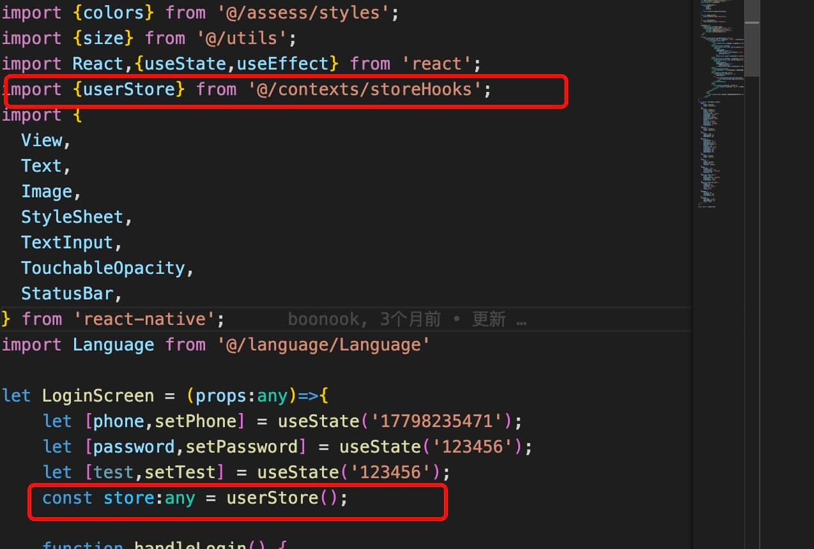
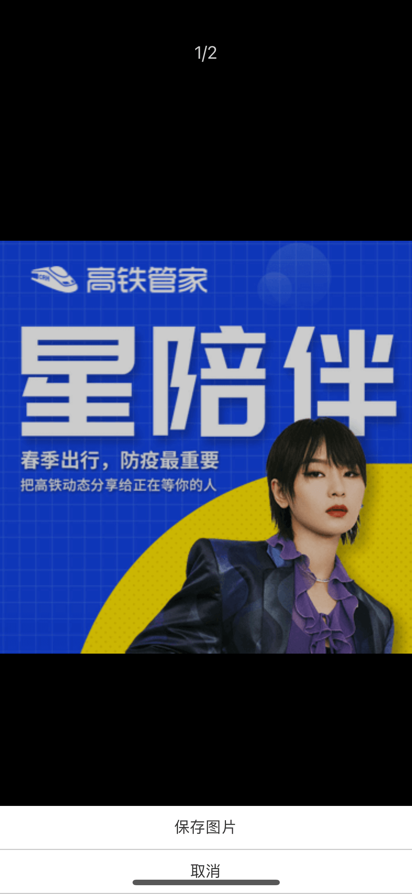
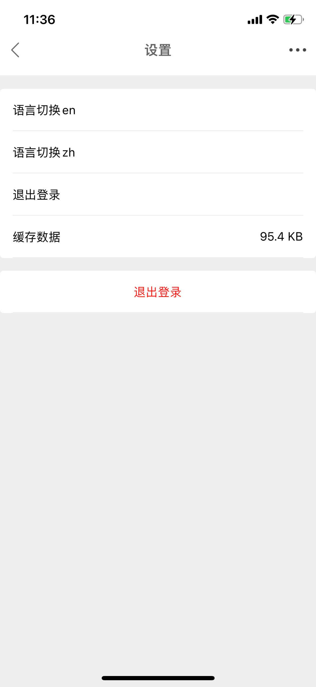

# react-native 0.67.2

# @react-navigation 6.xx.x  （./src/Routers.tsx）

# mobx （操作store更简单）
 

# axios网络请求封装 （./src/utils/Request.ts）

# 扫码 识别图中的二维码
 

# 图片选择器,图片裁剪，图片预览（放大缩小，长按图片可保存）




# 缓存以及清理缓存（主要针对网络图片）


# 语言设置目前只有中文和英文（可自由添加自己想要的语言类型）


# 生成二维码，长按二维码可保存
 

# webView封装以及h5配套方法的封装，非常方便直接使用h5来开发应用，h5的相关代封装代码可私聊（QQ:2056309708）


# 包括自定义导航栏、自定义状态栏，自定义方法的封装等，（./src/Components/header/*）

# 全局侧边栏
 

# 浏览器h5唤醒app

# 权限操作（待完善）

# 启动页设置（可直接更换图片即可）
 

# app图标可直接更换图片

# 颜色渐变

# 图片宽度一定高度自适应，网络图片使用缓存(宽度直接收 number 类型) （./src/Components/Image/*）

# 防止表单过长导致键盘遮挡输入框的异常（./src/screen/auth/ForgetPasswordSccreen.tsx）

# 屏幕大小适配（针对ipad需要用户自行设置）
```js
  ////375设计图尺寸
  export const size = s =>Dimensions.get('window').width / 375 * s;
```

# 主题切换 （demo在src/me/common/MySettingScreen.ts）
 

# <h1 style="color:red">您的支持将是我最大的动力</h1>


 


```js
git push github master
```

```js
  ./gradlew assembleRelease
  global.$ld() //使用loading
  global.$cld() //关闭loading
  global.$toast('提示信息') // toast提示
  global.$box({
    text: '提示信息', // 弹框提示信息(我设置的字段是text)
    callback: () => {console.log('我点击了确定按钮')} //确定按钮要做的事件
  }) // 弹框提示
```
